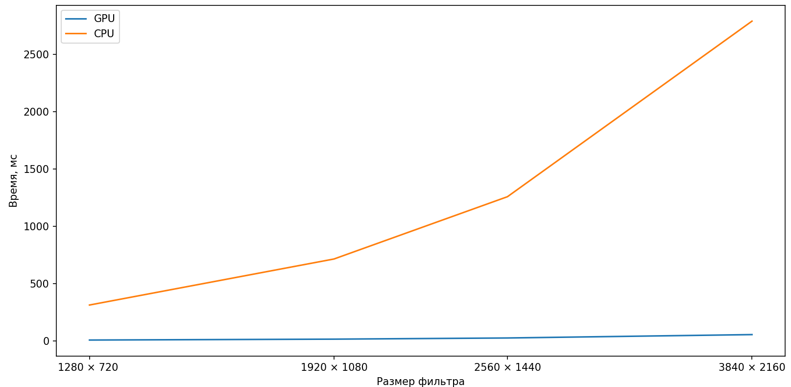
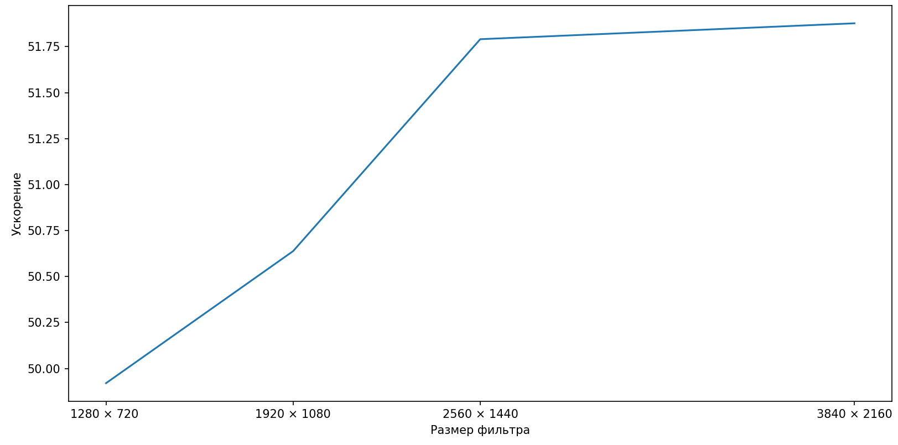
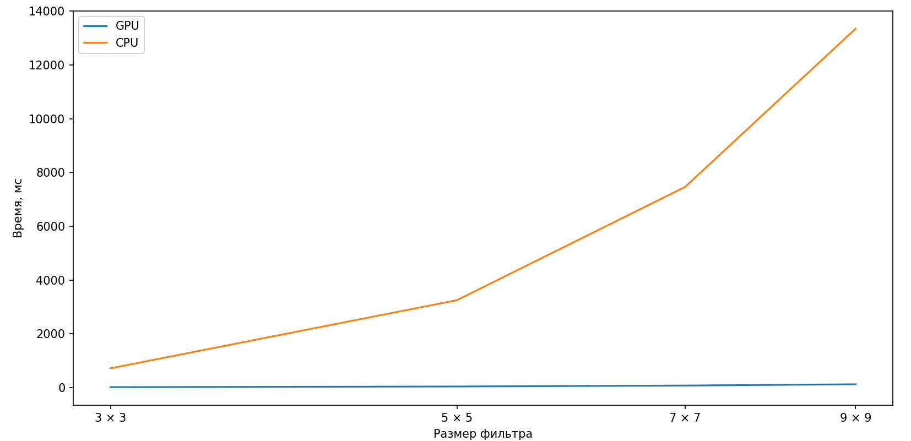
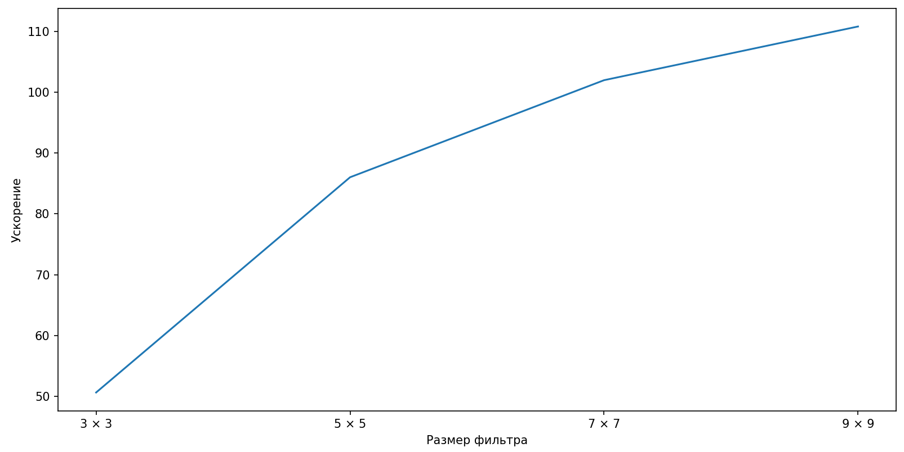

# Фильтр Гаусса
Лабораторная работа выполнена на c++, в среде программирования Visual Studio, на домашнем ПК.

# Алгоритм
 1. Считается необходимое количество потоков и блоков. Общее число потоков >= кол-ву элементов входной матрицы.
 2. Каждый поток "выбирает" пиксель изображения исходя из своих глобальных индексов на сетке.
 3. Каждый поток берет из текстурной памяти нужные элементы (в зависимости от размера фильтра), после чего поэлементно считает свое значение новго пикселя.
 5. В результирующую матрицу кладется посчитанное значение.

# Размеры блока и грида
Выбрана 2D топология блоков и их сетки, поскольку в таком случае алгоритм становится интуитивно понятным.
Размеры блока и сетки выбираются автоматически исходя из разрешенных пределов и скорости выполнения, с учетом того, что может быть выбран больший размер фильтра,
от размера которого зависит размер разделенной памяти.

# Оптимизации
В первой версии парарллельной программы присутсвовали некоторые ее части, которые хотелось изменить, чтобы ускорить программу.

Также изначально был использован тип int для хранения данных, но, поскольку работа ведется с ч/б изображениями, целесообразным стоит считать использование типа unsigned char(0-255).
Это позволило ускорить параллельный алгоритм чуть менее чем в 2 раза.

При подсчете элемента в фильтре изначально использовался тип данных double, хотя двойная точность тут не нужна, поэтому тип был изменен на float, то уменьшило время примерно на 20 %.
Также были вынесены константые выражения, которые можно посчитать заранее, что уменьшило время работы еще на 10 %.
Более того были упрощены выражения (одинаковые части были переиспользованы, также как и получение центрального элемента из текстурной памати), а также другие мелкие оптимизации. Эти оптимизации в сумме уменьшили время выполнения примерно на 15 %. 

# Эксперименты  1
Для тестирования работы программы была выбрана картинка грибов.

Исходное черно-бело изображение

Изображение, отфильтрованное последовательной программой (фильтр 7 х 7)

Изображение, отфильтрованное параллельной программой (фильтр 7 х 7)

# Эксперименты 2
Для проведения экспериментов со сревнением времени выполнения параллельной и последовательных программ была создана функция, которая генерирует изображение с заданными высотой и шириной.
Размеры изображений были выбраны в соответсвии с основными использующимися разрешениями. (HD, FullHd, 2K, 4K)

Время представлено усредненное по 12 запускам. 

Характеристики ПК

Процессор 			 intel core i7-13700K

Количество ядер		 16

Количество потоков 	 24

Оперативная память 	 32 ГБ DDR5

Видеокарта			 NVIDIA RTX 4070 Ti

Тип системы	Windows  10

Для сравнения времени выполнения в зависимости от размера изображения был использован фильтр 3 х 3.

Размер изображения  | Время выполнения GPU, мс 	| Время выполнения CPU, мс 	| Ускорение
------------------- | -------------------------	| ------------------------- | ----------
1280 × 720  	   	| 6,25    					| 312						| 
1920 × 1080 		| 14,1    					| 714						| 
2560 × 1440	   		| 24,29    					| 1258						| 
3840 × 2160  		| 53,8	   					| 2791						| 

Из графика и таблиы видно, что как для последовательной программы, так и для параллельной время увеличивается примерно в 2 раза с каждым шагом, что ожидаемо,
поскольку общее количество элементов с каждым увеличением разрешения становится примерно в 2 раза больше. 
Можно сделать предположение о том, что рост ускорения параллельной программы обусловлен использвоанием текстурной памяти, получение рядом стоящих элементов из которой кешируется, что должно быть более заметно с ростом количества обращений к ней.
Также виден резкий спад ускорения на размере 3840 × 2160, что происходит из-за невозможности одновременно выполнить большую часть потоков однвременно (кол-во "ожидающих" сильно увеличилось).

Для сравнения времени выполнения в зависимости от размера фильтра был выбран размер изображения 1920 × 1080.

Размер фильтра  | Время выполнения GPU, мс 	| Время выполнения CPU, мс | Ускорение
--------------- | -------------------------	| ------------------------ | ----------
3 × 3  			| 14,1     					| 714                      | 
5 × 5 			| 37,78    					| 3250                     | 
7 × 7	   		| 73,19    					| 7464                     | 
9 × 9  			| 120,47					| 13349                    | 

Для таблицы графика, отражающей зависимость времени выполнения от размера фильтра, видно, что время выполнения растет быстрее, чем размер фильтра для последовательной прграммы, однако для параллельной программы время увеличивается пропорционально кол-ву элементов для подсчета (т.е. кол-ву элементов фильтра).
Данный факт обусловлен относительно небольшим размером самого изображение, каждый пиксель которого может быть обработан без большого время ожидания потока (т.е. времени, которое "ожидают" данные для обработки варпом). Более того, все вычисления занимают одинаковое время для потоков (отсутсвие любого ветвления, кроме, разве что, для краев изображения, где кол-воэлементов для обработки у потоков разное), что сводит время простоя потоков (при ожидании друг друга в одном варпе) к минимуму.

В итоге можно сказать, что использование графического процессора при обработке фильтром Гаусса более чем оправдано.
При этом, использование алгоритма с большими фильтрами все еще остается эффективным.
